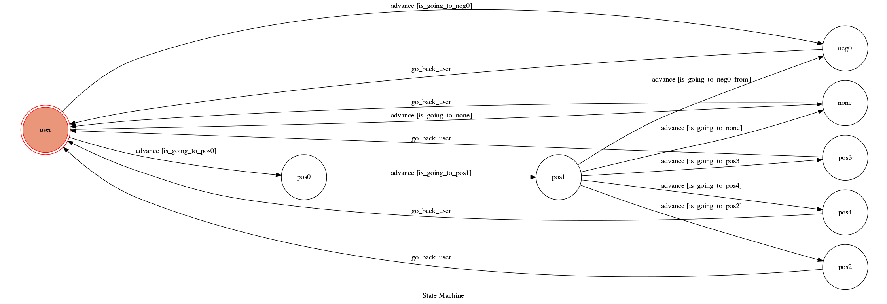

# TOC Project 2017

Template Code for TOC Project 2017

A telegram bot based on a finite state machine

## Setup

### Prerequisite
* Python 3

#### Install Dependency
```sh
pip install -r requirements.txt
```

* pygraphviz (For visualizing Finite State Machine)
    * [Setup pygraphviz on Ubuntu](http://www.jianshu.com/p/a3da7ecc5303)

### Secret Data

`WEBHOOK_URL` in app.py **MUST** be set to proper values.
Otherwise, you might not be able to run your code.

### Run Locally
You can either setup https server or using `ngrok` as a proxy.

**`ngrok` would be used in the following instruction**

```sh
ngrok http 5000
```

After that, `ngrok` would generate a https URL.

You should set `WEBHOOK_URL` (in app.py) to `your-https-URL/hook`.

#### Run the sever

```sh
python3 app.py
```

## Finite State Machine


## Usage
The initial state is set to `user`, and the bot will ask you question.

There are three differnet way to change state ,'positive power' ,'negative power' ,and 'neither'

* postive power
	* user:
                * Input: string with '正'
		* Reply: the encouragement and the picture. The bot also ask you if it is enough.
                * user -> pos0

	* pos0:
                * Input: anyinput (no matter what you what the bot will give you more courage).
		* Reply: the encouragement and the picture. The bot also ask you for somemore positve power or not.
                         if you don't want more. The bot will force you to accept.
                * pos0 -> pos1

	* pos1:
                * Input: string with '正'
		* Reply: the encouragement and the picture. The bot also ask you for somemore positve power or not.
                         There type state will **randomly** match.
                         The state will automatically return user.
                * pos1 -> pos2 / pos3 / pos4 -> user

* negative power:
                * Input: string with '正'
		* Reply: the discourage sentence and the gif animation.
                         There type reply will **randomly** match.
                         The effect is same as pos1 but practice by differnet way.
                         The state will automatically return user.
                * user -> neg0 -> user
* negative power:
                * Input: string without '正' and '負'
		* Reply: A part of lyrics and the music. (the file can be mp3 or mp4)
                         The state will automatically return user.
                * user -> none -> user

## Author
[Lee-W](https://github.com/Lee-W)
[yanang](https://github.com/yanang)

